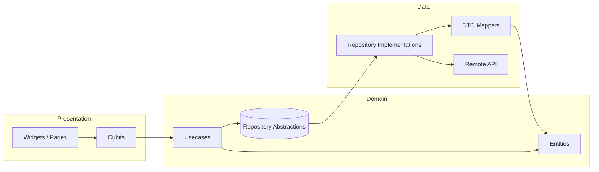

# SpaceX Explorer 🚀


A polished Flutter application that lets you explore SpaceX rockets and launches using a clean, testable architecture (Clean Architecture + Feature-first structure) with BLoC/Cubit state management. Designed as an educational yet production-minded reference for layering, dependency inversion, and UI composition.

---
## ✨ Highlights
- Clean, layered architecture (Domain / Data / Presentation / Feature modules)
- Reactive state management with `flutter_bloc` (Cubits)
- Dependency Injection via `get_it` (see `injection_container.dart`)
- Theming + dark space aesthetic (see `presentation/theme/space_theme.dart`)
- Extensible feature grouping under `lib/features/`
- Separation of DTOs vs domain Entities
- Reusable widgets (`presentation/widgets`) for cards and layout
- Route-based navigation with custom full-screen dialogs
- Ready for multi-platform (iOS, Android, Web, Desktop) – Flutter project scaffold provided
- Clearly defined result handling (`core/result.dart`) for error-safe flows

---
## 🗂 Directory Overview
```
lib/
  main.dart                  -> App entry + MultiBlocProvider
  injection_container.dart   -> DI setup for repositories, usecases, cubits
  core/                      -> Cross-cutting primitives (Result, errors, etc.)
  data/                      -> Concrete implementations & data sources (API, DTO, repositories)
    api/                     -> Remote API client(s)
    dto/                     -> Raw data transfer objects (serialization layer)
    repositories/            -> Data-layer repository implementations
    di/                      -> Data layer specific registrations (if split)
  domain/                    -> Business rules (Entities, Models, Repos abstractions, Usecases)
    entities/                -> Pure, immutable enterprise objects
    model/                   -> Domain-level models (if distinct from entities)
    repo/                    -> Abstract repository contracts
    usecases/                -> Interactors / application logic units
  features/                  -> Feature slices (e.g., spacex/) containing presentation + logic
    spacex/                  -> Cubits, views, feature-specific glue code
  presentation/              -> UI + Theme + Pages + Shared Widgets
    pages/                   -> Screens & route targets
    theme/                   -> App-wide theming
    widgets/                 -> Shared UI components (e.g., RocketCard, LaunchCard)
  utils/                     -> Extensions, constants, helpers
```

---
## 🧩 Architecture (Clean + Feature-first)
This project blends Clean Architecture boundaries with a pragmatic feature directory:

- Domain Layer: Pure business logic, no Flutter dependencies. Contains entities (immutable), repository interfaces, and use cases (application-specific actions). Test-friendly and framework-agnostic.
- Data Layer: Implements repository interfaces, handles API calls, maps DTOs to domain entities, and deals with error translation. Knows about external services but never leaks them outward.
- Presentation Layer: Flutter widgets + Cubits (BLoC) orchestrating UI state. Consumes domain use cases via DI.
- Feature Modules: Group together related presentation + cubits + minor adapters for better scaling.

### Dependency Flow
```
UI Widgets / Pages --> Cubits (State) --> Usecases --> Repositories (Abstract) --> Data Repositories (Concrete) --> API / Remote
```
Only arrows downward; no upward knowledge. Interfaces break cycles.

### Mermaid Diagram


---
## 🛠 Tech Stack
- Flutter (UI, cross-platform)
- Dart (Language)
- `flutter_bloc` (State management)
- `get_it` (Service locator / DI)
- SpaceX Public REST API (Remote data source)

---
## 🚀 Getting Started
### 1. Prerequisites
- Flutter SDK installed (stable channel)
- Dart >= constraint in `pubspec.yaml`
- iOS: Xcode & CocoaPods; Android: Android Studio + SDKs

### 2. Install Dependencies
```bash
flutter pub get
```

### 3. Run
```bash
# iOS Simulator
flutter run -d ios

# Android Emulator
flutter run -d android

# Web (Chrome)
flutter run -d chrome
```

### 4. Hot Reload / Restart
Use Flutter tooling or IDE shortcuts to iterate rapidly.

---
## 🧪 Testing Strategy (Suggested)
While only a sample test (`test/widget_test.dart`) may exist right now, the architecture supports deep testing:
- Domain: Pure Dart unit tests for usecases & entities
- Data: Mock API adapters; verify mapping & error handling
- Presentation: Cubit tests using `bloc_test` (state emission sequences)
- Widget: Golden tests for consistent UI rendering

Add packages:
```bash
flutter pub add dev:bloc_test dev:mocktail dev:flutter_test
```

Example (pseudo):
```dart
blocTest<RocketsCubit, RocketsState>(
  'emits loaded when repository succeeds',
  build: () => RocketsCubit(mockGetRocketsUsecase),
  act: (cubit) => cubit.load(),
  expect: () => [isA<RocketsLoading>(), isA<RocketsLoaded>()],
);
```

---
## 🔌 Dependency Injection
Centralized in `injection_container.dart`:
- Registers usecases
- Registers repository implementations against abstract types
- Registers Cubits for retrieval via `sl<T>()`

Keeps construction logic decoupled from consumers.

---
## 📦 Result & Error Handling
`core/result.dart` standardizes success/error flows:
- Prevents throwing exceptions across layers
- Encourages explicit success/failure pattern matching

Example pattern:
```dart
final result = await usecase();
result.when(
  success: (data) => emit(State.loaded(data)),
  failure: (err) => emit(State.error(err.message)),
);
```

---
## 🎨 UI / Theming
`SpaceTheme.build()` defines consistent colors, typography, and dark styling suitable for a space exploration context. Widgets like `RocketCard` and `LaunchCard` present domain entities in a succinct, reusable format.

Starfield / space background effects can be extended with custom painters or animated widgets for more flair.

---
## 🔄 Navigation
`MaterialApp.onGenerateRoute` in `main.dart` provides typed, argument-based routing:
- `/rocket` -> `RocketDetailPage`
- `/launch` -> `LaunchDetailPage`
- `/rocket_full` & `/launch_full` -> Fullscreen card experiences

Feature modules could supply their own route registration for scaling.

---
## 🧱 Extending Features
1. Create new folder in `features/` (e.g., `missions/`)
2. Add Cubit + states + pages
3. Add usecases in domain layer
4. Add repository contracts & implementations
5. Register everything in `injection_container.dart`
6. Add navigation route(s)

---
## 🧭 Roadmap / Ideas
- Offline caching layer (Hive / SQLite)
- Error boundary widget + retries
- Search & filtering for launches/rockets
- Favorites persistence
- Light theme variant
- CI workflow (GitHub Actions) for tests + formatting
- Golden tests for design locking

---
## 🤝 Contributing
1. Fork & create a feature branch
2. Follow existing folder conventions
3. Add/Update tests for new logic
4. Run `dart format .` and ensure analyzer passes
5. Open a PR with a concise summary & screenshots if UI-related

---
## 🧾 License
MIT License – free to use, modify, and distribute. Attribution appreciated.

```
Copyright (c) 2025 SpaceX Explorer

Permission is hereby granted, free of charge, to any person obtaining a copy
of this software and associated documentation files (the "Software"), to deal
in the Software without restriction, including without limitation the rights
to use, copy, modify, merge, publish, distribute, sublicense, and/or sell
copies of the Software, and to permit persons to whom the Software is
furnished to do so, subject to the following conditions:

The above copyright notice and this permission notice shall be included in all
copies or substantial portions of the Software.

THE SOFTWARE IS PROVIDED "AS IS", WITHOUT WARRANTY OF ANY KIND, EXPRESS OR
IMPLIED, INCLUDING BUT NOT LIMITED TO THE WARRANTIES OF MERCHANTABILITY,
FITNESS FOR A PARTICULAR PURPOSE AND NONINFRINGEMENT. IN NO EVENT SHALL THE
AUTHORS OR COPYRIGHT HOLDERS BE LIABLE FOR ANY CLAIM, DAMAGES OR OTHER
LIABILITY, WHETHER IN AN ACTION OF CONTRACT, TORT OR OTHERWISE, ARISING FROM,
OUT OF OR IN CONNECTION WITH THE SOFTWARE OR THE USE OR OTHER DEALINGS IN THE
SOFTWARE.
```

---
## 🛰 Attribution & Data Source
Data provided by the public SpaceX API. This is an educational client and not an official SpaceX product.

---
## 📣 Feedback
Open an issue or start a discussion – improvements & suggestions welcome!

---
Enjoy exploring SpaceX missions and technology with a cleanly architected Flutter codebase. 🌌
